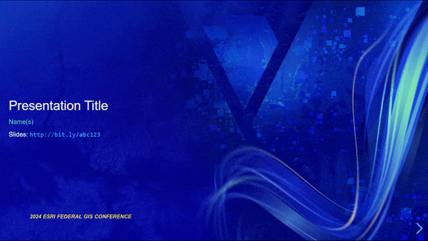

# Esri reveal.js

> reveal decks to look like the Esri templates

A jumpstart for Esri staff that want their reveal decks to look like the templates that are distributed for PowerPoint.

Live demos:

* [2018 FedUC / DC DevSummit](https://esri.github.io/reveal.js/feduc-2018.html)
* [2018 DevSummit template](https://esri.github.io/reveal.js/devsummit-2018.html)

For archived older versions, please see [releases](https://github.com/esri/reveal-js/releases).

## Documentation

See: [reveal.js documentation](https://github.com/hakimel/reveal.js/blob/master/README.md)

## License

Copyright (C) 2017 Hakim El Hattab, http://hakim.se

reveal.js is MIT licensed;
you may not use this file except in compliance with the License.
You may obtain a copy of the License at

> https://github.com/hakimel/reveal.js/blob/master/LICENSE

Unless required by applicable law or agreed to in writing, software
distributed under the License is distributed on an "AS IS" BASIS,
WITHOUT WARRANTIES OR CONDITIONS OF ANY KIND, either express or implied.
See the License for the specific language governing permissions and
limitations under the License.

A copy of the license is available in the repository's [LICENSE](./LICENSE) file.
